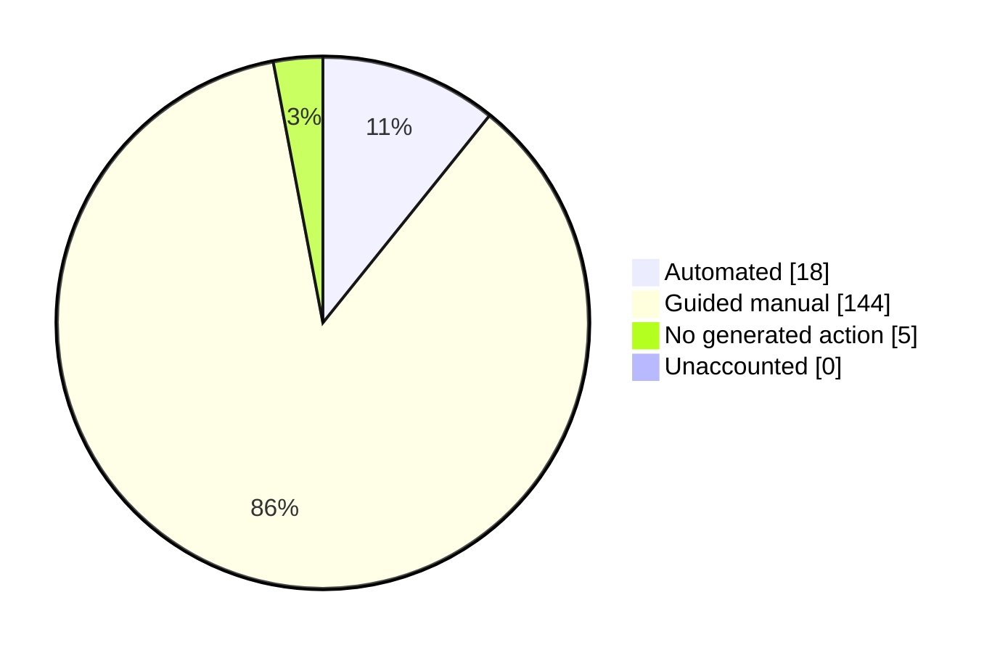

# Feature coverage dashboard

> Generated by `npm run docs:features`. Do not edit this file by hand.

This dashboard tracks every Policy Analyzer feature key known to the repository. A pull request that adds or changes a mapper automatically changes this report.

| Metric | Count |
| --- | ---: |
| Total Analyzer feature keys | 167 |
| Automated | 18 |
| Guided manual | 144 |
| No generated action | 5 |
| Unaccounted | 0 |

## Feature details

| Analyzer feature | Migration path | Verification | Generated action |
| --- | --- | --- | --- |
| `global_infra_ddosCdn` | Guided manual | Manual | — |
| `global_infra_ddosWaf` | Guided manual | Manual | — |
| `global_infra_hostnameRestriction` | Guided manual | Manual | — |
| `global_infra_journeyTimeMeasurement` | Guided manual | Manual | — |
| `global_infra_orchestrationBranching` | Guided manual | Manual | — |
| `global_infra_orchestrationLinear` | No generated action | Platform/default behavior | — |
| `global_infra_restApiClientCert` | Guided manual | Manual | — |
| `global_infra_restApiCollect` | Guided manual | Manual | — |
| `global_infra_restApiValidate` | Guided manual | Manual | — |
| `global_infra_restrictPolicyToApp` | Guided manual | Manual | — |
| `global_infra_subJourneys` | Guided manual | Manual | — |
| `global_infra_throttlingGeoBlocking` | Guided manual | Manual | — |
| `global_infra_userGroups` | Guided manual | Manual | — |
| `global_infra_validationChains` | Guided manual | Manual | — |
| `global_s2s_clientCredentials` | Guided manual | Manual | — |
| `global_s2s_onBehalfOf` | Guided manual | Manual | — |
| `global_token_claimsMapping` | Automated | Automated; live validation required | `01-create-native-app.ps1`, `08-claims-mapping-policy.ps1` |
| `global_token_claimsTransformChain` | Guided manual | Manual | — |
| `global_token_claimsTransformation` | Guided manual | Manual | — |
| `global_token_customIssuer` | Guided manual | Manual | — |
| `global_token_customSigningCert` | Guided manual | Manual | — |
| `global_token_directoryRead` | Guided manual | Manual | — |
| `global_token_directoryWrite` | Guided manual | Manual | — |
| `global_token_encryption` | Guided manual | Manual | — |
| `global_token_externalClaims` | Automated | Automated; live validation required | `01-create-native-app.ps1`, `08-claims-mapping-policy.ps1` |
| `global_token_lifetimeManagement` | No generated action | Platform/default behavior | — |
| `global_token_passthroughNoDirectory` | Guided manual | Manual | — |
| `global_token_perAppClaimsFilter` | Guided manual | Manual | — |
| `global_token_refreshToken` | No generated action | Platform/default behavior | — |
| `global_token_regexClaimsExtract` | Guided manual | Manual | — |
| `global_token_samlCustomSigning` | Guided manual | Manual | — |
| `global_token_subClaimOverride` | Guided manual | Manual | — |
| `global_ux_advancedUiCustomization` | Guided manual | Manual | — |
| `global_ux_claimsProviderSelection` | Guided manual | Manual | — |
| `global_ux_conditionalIdpPresentation` | Guided manual | Manual | — |
| `global_ux_customDomain` | Guided manual | Manual | — |
| `global_ux_customEmailTemplate` | Guided manual | Manual | — |
| `global_ux_customQueryParams` | Guided manual | Manual | — |
| `global_ux_customSmsTemplate` | Guided manual | Manual | — |
| `global_ux_displayControls` | Guided manual | Manual | — |
| `global_ux_domainBranding` | Guided manual | Manual | — |
| `global_ux_dynamicDropdown` | Guided manual | Manual | — |
| `global_ux_embeddedAuthUi` | Guided manual | Manual | — |
| `global_ux_localization` | Guided manual | Manual | — |
| `global_ux_multiStepApiValidation` | Guided manual | Manual | — |
| `global_ux_multiStepJourney` | Guided manual | Manual | — |
| `global_ux_perAppBranding` | Guided manual | Manual | — |
| `global_ux_splitSignUpPages` | Guided manual | Manual | — |
| `global_ux_tenantBranding` | Automated | Automated; live validation required | `Port 4001 Graph apply` |
| `invitation_adminEntraId` | Guided manual | Manual | — |
| `invitation_adminSocialIdp` | Guided manual | Manual | — |
| `invitation_userEntraId` | Guided manual | Manual | — |
| `invitation_userMagicLink` | Guided manual | Manual | — |
| `invitation_userQrCode` | Guided manual | Manual | — |
| `passwordReset_bannedList` | Guided manual | Manual | — |
| `passwordReset_changeDuringSignIn` | Guided manual | Manual | — |
| `passwordReset_changeForSignedUser` | Guided manual | Manual | — |
| `passwordReset_customRegexComplexity` | Guided manual | Manual | — |
| `passwordReset_emailOrPhone` | Guided manual | Manual | — |
| `passwordReset_embedded` | Guided manual | Manual | — |
| `passwordReset_expirationHistoryBan` | Guided manual | Manual | — |
| `passwordReset_externalStore` | Guided manual | Manual | — |
| `passwordReset_externalValidation` | Guided manual | Manual | — |
| `passwordReset_force` | Guided manual | Manual | — |
| `passwordReset_forceAfter90Days` | Guided manual | Manual | — |
| `passwordReset_forceFirstLogon` | Guided manual | Manual | — |
| `passwordReset_history` | Guided manual | Manual | — |
| `passwordReset_phoneNumber` | Guided manual | Manual | — |
| `passwordReset_preventReuse` | Guided manual | Manual | — |
| `passwordReset_recovery` | Automated | Partial automation with required follow-up | `01-create-native-app.ps1`, `02-create-user-flow.ps1`, `09-enable-sspr.ps1` |
| `passwordReset_security_passwordComplexity` | Guided manual | Manual | — |
| `passwordReset_standalone` | Guided manual | Manual | — |
| `passwordReset_usernameDiscovery` | Guided manual | Manual | — |
| `passwordReset_verifyEmailExists` | Guided manual | Manual | — |
| `profileEdit_attributesViaApi` | Guided manual | Manual | — |
| `profileEdit_attributesViaUi` | Guided manual | Manual | — |
| `profileEdit_changeUsername` | Guided manual | Manual | — |
| `profileEdit_linkLocalToSocial` | Guided manual | Manual | — |
| `profileEdit_linkMultipleSocial` | Guided manual | Manual | — |
| `profileEdit_progressiveProfiling` | Guided manual | Manual | — |
| `signIn_attributes_collectDuringSignIn` | Guided manual | Manual | — |
| `signIn_auth_emailPassword` | Automated | Live verified | `01-create-native-app.ps1`, `02-create-user-flow.ps1`, `03-smoke-test-native-auth.ps1` |
| `signIn_auth_passkey` | Automated | Partial automation with required follow-up | `01-create-native-app.ps1`, `13-enable-passkey.ps1` |
| `signIn_auth_phoneSmsPassword` | Guided manual | Manual | — |
| `signIn_auth_qrCode` | Guided manual | Manual | — |
| `signIn_auth_usernamePassword` | Guided manual | Manual | — |
| `signIn_auth_verifiedId` | Guided manual | Manual | — |
| `signIn_hrd_defaultIdp` | Guided manual | Manual | — |
| `signIn_hrd_domainBased_OIDC` | Guided manual | Manual | — |
| `signIn_hrd_domainBased_SAML` | Guided manual | Manual | — |
| `signIn_hrd_domainRouting` | Guided manual | Manual | — |
| `signIn_hrd_idpFiltering` | Guided manual | Manual | — |
| `signIn_idp_apple` | Guided manual | Manual | — |
| `signIn_idp_enterpriseOAuth` | Guided manual | Manual | — |
| `signIn_idp_enterpriseSaml` | Guided manual | Manual | — |
| `signIn_idp_entraId` | Guided manual | Manual | — |
| `signIn_idp_entraIdMultiTenant` | Guided manual | Manual | — |
| `signIn_idp_facebook` | Automated | Automated; live validation required | `01-create-native-app.ps1`, `02-create-user-flow.ps1`, `05-add-facebook-idp.ps1`, `03-smoke-test-native-auth.ps1` |
| `signIn_idp_google` | Automated | Automated; live validation required | `01-create-native-app.ps1`, `02-create-user-flow.ps1`, `04-add-google-idp.ps1`, `03-smoke-test-native-auth.ps1` |
| `signIn_idp_linkedIn` | Guided manual | Manual | — |
| `signIn_idp_microsoftAccount` | Guided manual | Manual | — |
| `signIn_idp_partnerIdp` | Guided manual | Manual | — |
| `signIn_idp_samlArtifactBinding` | Guided manual | Manual | — |
| `signIn_idp_samlTokenEncryption` | Guided manual | Manual | — |
| `signIn_idp_weChat` | Guided manual | Manual | — |
| `signIn_idp_wsFederation` | Guided manual | Manual | — |
| `signIn_mfa_customControls` | Guided manual | Manual | — |
| `signIn_mfa_customRest` | Guided manual | Manual | — |
| `signIn_mfa_pushNotification` | Guided manual | Manual | — |
| `signIn_mfa_stepUp` | Automated | Partial automation with required follow-up | `01-create-native-app.ps1`, `12-create-ca-policy.ps1` |
| `signIn_otp_authenticatorApp` | Guided manual | Manual | — |
| `signIn_otp_email` | Automated | Live verified | `01-create-native-app.ps1`, `02-create-user-flow.ps1`, `07-enable-email-otp.ps1`, `03-smoke-test-native-auth.ps1` |
| `signIn_otp_phoneSms` | Automated | Partial automation with required follow-up | `01-create-native-app.ps1`, `11-enable-sms-mfa.ps1` |
| `signIn_otp_phoneVoice` | Guided manual | Manual | — |
| `signIn_s2s_ropc` | Guided manual | Manual | — |
| `signIn_security_accountLockout` | Guided manual | Manual | — |
| `signIn_security_accountTakeoverProtection` | Guided manual | Manual | — |
| `signIn_security_caCustomPolicy` | Guided manual | Manual | — |
| `signIn_security_callCenterValidation` | Guided manual | Manual | — |
| `signIn_security_captchaOnSignIn` | Guided manual | Manual | — |
| `signIn_security_conditionalAccess` | Automated | Partial automation with required follow-up | `01-create-native-app.ps1`, `12-create-ca-policy.ps1` |
| `signIn_security_idpInitiatedSso` | Guided manual | Manual | — |
| `signIn_security_impersonation` | Guided manual | Manual | — |
| `signIn_security_preventDisabledSocialLogon` | No generated action | Platform/default behavior | — |
| `signIn_security_socialForceEmailUniqueness` | Guided manual | Manual | — |
| `signIn_security_socialForceEmailVerification` | Guided manual | Manual | — |
| `signIn_session_cookieRevocation` | Guided manual | Manual | — |
| `signIn_session_customTimeouts` | Guided manual | Manual | — |
| `signIn_session_kmsi` | Guided manual | Manual | — |
| `signIn_session_lifecycleManagement` | No generated action | Platform/default behavior | — |
| `signIn_session_rememberIdp` | Guided manual | Manual | — |
| `signIn_ux_guidedFlow` | Guided manual | Manual | — |
| `signIn_ux_updatedConsent` | Guided manual | Manual | — |
| `signUp_attributes_custom` | Automated | Live verified | `01-create-native-app.ps1`, `02-create-user-flow.ps1`, `03-smoke-test-native-auth.ps1` |
| `signUp_attributes_standard` | Automated | Live verified | `01-create-native-app.ps1`, `02-create-user-flow.ps1`, `03-smoke-test-native-auth.ps1` |
| `signUp_attributes_visitHistory` | Guided manual | Manual | — |
| `signUp_auth_emailPassword` | Automated | Live verified | `01-create-native-app.ps1`, `02-create-user-flow.ps1`, `03-smoke-test-native-auth.ps1` |
| `signUp_auth_nonEmailUsername` | Guided manual | Manual | — |
| `signUp_auth_passkey` | Guided manual | Manual | — |
| `signUp_auth_phoneSmsOTP` | Guided manual | Manual | — |
| `signUp_auth_qrCode` | Guided manual | Manual | — |
| `signUp_auth_usernamePassword` | Guided manual | Manual | — |
| `signUp_auth_verifiableCredential` | Guided manual | Manual | — |
| `signUp_auth_verifiedId` | Guided manual | Manual | — |
| `signUp_idp_apple` | Guided manual | Manual | — |
| `signUp_idp_enterpriseOAuth` | Guided manual | Manual | — |
| `signUp_idp_enterpriseOidc` | Guided manual | Manual | — |
| `signUp_idp_enterpriseSaml` | Guided manual | Manual | — |
| `signUp_idp_facebook` | Automated | Automated; live validation required | `01-create-native-app.ps1`, `02-create-user-flow.ps1`, `05-add-facebook-idp.ps1`, `03-smoke-test-native-auth.ps1` |
| `signUp_idp_google` | Automated | Automated; live validation required | `01-create-native-app.ps1`, `02-create-user-flow.ps1`, `04-add-google-idp.ps1`, `03-smoke-test-native-auth.ps1` |
| `signUp_idp_linkedIn` | Guided manual | Manual | — |
| `signUp_idp_microsoftAccount` | Guided manual | Manual | — |
| `signUp_mfa_authy` | Guided manual | Manual | — |
| `signUp_mfa_enrollAdditional` | Guided manual | Manual | — |
| `signUp_noEmailVerification` | Guided manual | Manual | — |
| `signUp_otp_authenticatorApp` | Guided manual | Manual | — |
| `signUp_otp_email` | Automated | Live verified | `01-create-native-app.ps1`, `02-create-user-flow.ps1`, `07-enable-email-otp.ps1`, `03-smoke-test-native-auth.ps1` |
| `signUp_otp_phoneSms` | Guided manual | Manual | — |
| `signUp_otp_phoneVoice` | Guided manual | Manual | — |
| `signUp_security_ageGating` | Guided manual | Manual | — |
| `signUp_security_byoFraudProvider` | Guided manual | Manual | — |
| `signUp_security_disableViaApi` | Guided manual | Manual | — |
| `signUp_security_fraudDetection` | Guided manual | Manual | — |
| `signUp_termsOfUse` | Guided manual | Manual | — |
| `signUp_ux_guidedMultiStep` | Guided manual | Manual | — |
| `signUp_ux_multiPageRegistration` | Guided manual | Manual | — |
| `signUp_ux_noSignInPrompt` | Guided manual | Manual | — |

## Interpreting verification

- **Live verified:** exercised against an External ID test tenant.
- **Automated; live validation required:** implemented using documented APIs and covered by deterministic/mocked tests, but the final tenant/provider behavior must be verified.
- **Partial automation with required follow-up:** the tool configures the safe automated portion and emits explicit follow-up steps.
- **Guided manual:** the platform supports a path, but the tool does not claim an automated write.
- **No generated action:** External ID handles the behavior by default or outside the script package.
