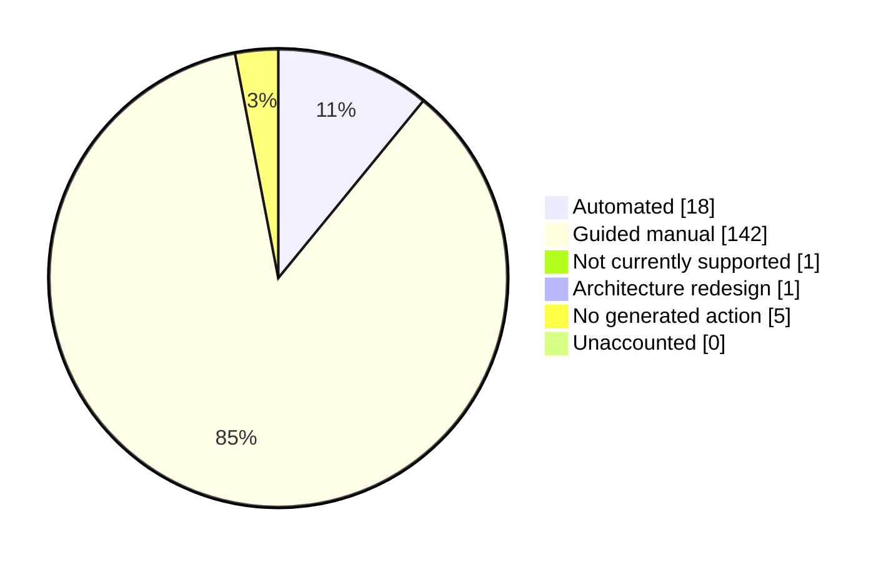

# Feature coverage dashboard

> Generated by `npm run docs:features`. Do not edit this file by hand.

This dashboard tracks every Policy Analyzer feature key known to the repository. A pull request that adds or changes a mapper automatically changes this report.

| Metric | Count |
| --- | ---: |
| Total Analyzer feature keys | 167 |
| Automated | 18 |
| Guided manual | 142 |
| Not currently supported | 1 |
| Architecture redesign | 1 |
| No generated action | 5 |
| Unaccounted | 0 |

## Feature details

| Analyzer feature | Migration path | Verification | Generated action | Notes |
| --- | --- | --- | --- | --- |
| `global_infra_ddosCdn` | Guided manual | Manual | — | Follow the documented External ID migration path. (Detected as available in External ID, but this tool does not generate a script for it yet — configure manually.) |
| `global_infra_ddosWaf` | Guided manual | Manual | — | Follow the documented External ID migration path. (Detected as available in External ID, but this tool does not generate a script for it yet — configure manually.) |
| `global_infra_hostnameRestriction` | Guided manual | Manual | — | Follow the documented External ID migration path. (Detected as available in External ID, but this tool does not generate a script for it yet — configure manually.) |
| `global_infra_journeyTimeMeasurement` | Guided manual | Manual | — | Follow the documented External ID migration path. (Detected as available in External ID, but this tool does not generate a script for it yet — configure manually.) |
| `global_infra_orchestrationBranching` | Guided manual | Manual | — | Follow the documented External ID migration path. (Detected as available in External ID, but this tool does not generate a script for it yet — configure manually.) |
| `global_infra_orchestrationLinear` | No generated action | Platform/default behavior | — | Linear orchestration is the default model in External ID user flows. |
| `global_infra_restApiClientCert` | Guided manual | Manual | — | Follow the documented External ID migration path. (Detected as available in External ID, but this tool does not generate a script for it yet — configure manually.) |
| `global_infra_restApiCollect` | Guided manual | Manual | — | Follow the documented External ID migration path. (Detected as available in External ID, but this tool does not generate a script for it yet — configure manually.) |
| `global_infra_restApiValidate` | Guided manual | Manual | — | Follow the documented External ID migration path. (Detected as available in External ID, but this tool does not generate a script for it yet — configure manually.) |
| `global_infra_restrictPolicyToApp` | Guided manual | Manual | — | Follow the documented External ID migration path. (Detected as available in External ID, but this tool does not generate a script for it yet — configure manually.) |
| `global_infra_subJourneys` | Guided manual | Manual | — | Follow the documented External ID migration path. (Detected as available in External ID, but this tool does not generate a script for it yet — configure manually.) |
| `global_infra_throttlingGeoBlocking` | Guided manual | Manual | — | Follow the documented External ID migration path. (Detected as available in External ID, but this tool does not generate a script for it yet — configure manually.) |
| `global_infra_userGroups` | Guided manual | Manual | — | Follow the documented External ID migration path. (Detected as available in External ID, but this tool does not generate a script for it yet — configure manually.) |
| `global_infra_validationChains` | Guided manual | Manual | — | Follow the documented External ID migration path. (Detected as available in External ID, but this tool does not generate a script for it yet — configure manually.) |
| `global_s2s_clientCredentials` | Guided manual | Manual | — | Follow the documented External ID migration path. (Detected as available in External ID, but this tool does not generate a script for it yet — configure manually.) |
| `global_s2s_onBehalfOf` | Guided manual | Manual | — | Follow the documented External ID migration path. (Detected as available in External ID, but this tool does not generate a script for it yet — configure manually.) |
| `global_token_claimsMapping` | Automated | Automated; live validation required | `01-create-native-app.ps1`, `08-claims-mapping-policy.ps1` | Claims mapping policy requires an app registration and service principal; global_token_claimsMapping requires a claims mapping policy assigned to the SP; Sign in through the target application, decode a real token, and compare every expected claim and value with the source contract. |
| `global_token_claimsTransformChain` | Guided manual | Manual | — | Follow the documented External ID migration path. (Detected as available in External ID, but this tool does not generate a script for it yet — configure manually.) |
| `global_token_claimsTransformation` | Guided manual | Manual | — | Reimplement required runtime transformations in an appropriate custom authentication extension, commonly OnTokenIssuanceStart for token enrichment or OnAttributeCollectionSubmit for sign-up validation. Keep simple renames as claims mappings. |
| `global_token_customIssuer` | Guided manual | Manual | — | Follow the documented External ID migration path. (Detected as available in External ID, but this tool does not generate a script for it yet — configure manually.) |
| `global_token_customSigningCert` | Guided manual | Manual | — | Follow the documented External ID migration path. (Detected as available in External ID, but this tool does not generate a script for it yet — configure manually.) |
| `global_token_directoryRead` | Guided manual | Manual | — | Follow the documented External ID migration path. (Detected as available in External ID, but this tool does not generate a script for it yet — configure manually.) |
| `global_token_directoryWrite` | Guided manual | Manual | — | Follow the documented External ID migration path. (Detected as available in External ID, but this tool does not generate a script for it yet — configure manually.) |
| `global_token_encryption` | Guided manual | Manual | — | Follow the documented External ID migration path. (Detected as available in External ID, but this tool does not generate a script for it yet — configure manually.) |
| `global_token_externalClaims` | Automated | Partial automation with required follow-up | `01-create-native-app.ps1`, `08-claims-mapping-policy.ps1` | Custom token claims require an app registration and service principal; global_token_externalClaims uses a claims mapping policy to emit custom claims in the token; Use the generated claims mapping policy for directory-backed claims. Resolve any custom attribute IDs after creation, and use an OnTokenIssuanceStart custom authentication extension for claims fetched from external systems. Compare the final External ID token with the source B2C token. |
| `global_token_lifetimeManagement` | No generated action | Platform/default behavior | — | Token lifetime policies are configurable in External ID. No script needed. |
| `global_token_passthroughNoDirectory` | Architecture redesign | Architecture redesign | — | Redesign the credential, federation, account-linking, user-lifecycle, and token-issuance architecture before provisioning the target application. |
| `global_token_perAppClaimsFilter` | Guided manual | Manual | — | Follow the documented External ID migration path. (Detected as available in External ID, but this tool does not generate a script for it yet — configure manually.) |
| `global_token_refreshToken` | No generated action | Platform/default behavior | — | Refresh tokens are supported by default in External ID. No configuration needed. |
| `global_token_regexClaimsExtract` | Guided manual | Manual | — | Follow the documented External ID migration path. (Detected as available in External ID, but this tool does not generate a script for it yet — configure manually.) |
| `global_token_samlCustomSigning` | Guided manual | Manual | — | Follow the documented External ID migration path. (Detected as available in External ID, but this tool does not generate a script for it yet — configure manually.) |
| `global_token_subClaimOverride` | Guided manual | Manual | — | Follow the documented External ID migration path. (Detected as available in External ID, but this tool does not generate a script for it yet — configure manually.) |
| `global_ux_advancedUiCustomization` | Guided manual | Manual | — | Follow the documented External ID migration path. (Detected as available in External ID, but this tool does not generate a script for it yet — configure manually.) |
| `global_ux_claimsProviderSelection` | Guided manual | Manual | — | Follow the documented External ID migration path. (Detected as available in External ID, but this tool does not generate a script for it yet — configure manually.) |
| `global_ux_conditionalIdpPresentation` | Guided manual | Manual | — | Follow the documented External ID migration path. (Detected as available in External ID, but this tool does not generate a script for it yet — configure manually.) |
| `global_ux_customDomain` | Guided manual | Manual | — | Follow the documented External ID migration path. (Detected as available in External ID, but this tool does not generate a script for it yet — configure manually.) |
| `global_ux_customEmailTemplate` | Guided manual | Manual | — | Follow the documented External ID migration path. (Detected as available in External ID, but this tool does not generate a script for it yet — configure manually.) |
| `global_ux_customQueryParams` | Guided manual | Manual | — | Follow the documented External ID migration path. (Detected as available in External ID, but this tool does not generate a script for it yet — configure manually.) |
| `global_ux_customSmsTemplate` | Not currently supported | Not currently supported | — | Use Microsoft-managed SMS if it meets the requirement. If custom routing or templating is mandatory, record this as a platform gap and redesign communication outside the authentication OTP pipeline. |
| `global_ux_displayControls` | Guided manual | Manual | — | Follow the documented External ID migration path. (Detected as available in External ID, but this tool does not generate a script for it yet — configure manually.) |
| `global_ux_domainBranding` | Guided manual | Manual | — | Follow the documented External ID migration path. (Detected as available in External ID, but this tool does not generate a script for it yet — configure manually.) |
| `global_ux_dynamicDropdown` | Guided manual | Manual | — | Follow the documented External ID migration path. (Detected as available in External ID, but this tool does not generate a script for it yet — configure manually.) |
| `global_ux_embeddedAuthUi` | Guided manual | Manual | — | Follow the documented External ID migration path. (Detected as available in External ID, but this tool does not generate a script for it yet — configure manually.) |
| `global_ux_localization` | Guided manual | Manual | — | Configure Company Branding language localizations and localized user-flow attribute labels in the Entra admin center. |
| `global_ux_multiStepApiValidation` | Guided manual | Manual | — | Follow the documented External ID migration path. (Detected as available in External ID, but this tool does not generate a script for it yet — configure manually.) |
| `global_ux_multiStepJourney` | Guided manual | Manual | — | Follow the documented External ID migration path. (Detected as available in External ID, but this tool does not generate a script for it yet — configure manually.) |
| `global_ux_perAppBranding` | Guided manual | Manual | — | Follow the documented External ID migration path. (Detected as available in External ID, but this tool does not generate a script for it yet — configure manually.) |
| `global_ux_splitSignUpPages` | Guided manual | Manual | — | Follow the documented External ID migration path. (Detected as available in External ID, but this tool does not generate a script for it yet — configure manually.) |
| `global_ux_tenantBranding` | Automated | Automated; live validation required | `Port 4001 Graph apply` | The guided port-4001 workflow can import, preview, and write Company Branding. |
| `invitation_adminEntraId` | Guided manual | Manual | — | Follow the documented External ID migration path. (Detected as available in External ID, but this tool does not generate a script for it yet — configure manually.) |
| `invitation_adminSocialIdp` | Guided manual | Manual | — | Follow the documented External ID migration path. (Detected as available in External ID, but this tool does not generate a script for it yet — configure manually.) |
| `invitation_userEntraId` | Guided manual | Manual | — | Follow the documented External ID migration path. (Detected as available in External ID, but this tool does not generate a script for it yet — configure manually.) |
| `invitation_userMagicLink` | Guided manual | Manual | — | Follow the documented External ID migration path. (Detected as available in External ID, but this tool does not generate a script for it yet — configure manually.) |
| `invitation_userQrCode` | Guided manual | Manual | — | Follow the documented External ID migration path. (Detected as available in External ID, but this tool does not generate a script for it yet — configure manually.) |
| `passwordReset_bannedList` | Guided manual | Manual | — | Follow the documented External ID migration path. (Detected as available in External ID, but this tool does not generate a script for it yet — configure manually.) |
| `passwordReset_changeDuringSignIn` | Guided manual | Manual | — | Follow the documented External ID migration path. (Detected as available in External ID, but this tool does not generate a script for it yet — configure manually.) |
| `passwordReset_changeForSignedUser` | Guided manual | Manual | — | Follow the documented External ID migration path. (Detected as available in External ID, but this tool does not generate a script for it yet — configure manually.) |
| `passwordReset_customRegexComplexity` | Guided manual | Manual | — | Follow the documented External ID migration path. (Detected as available in External ID, but this tool does not generate a script for it yet — configure manually.) |
| `passwordReset_emailOrPhone` | Guided manual | Manual | — | Follow the documented External ID migration path. (Detected as available in External ID, but this tool does not generate a script for it yet — configure manually.) |
| `passwordReset_embedded` | Guided manual | Manual | — | Follow the documented External ID migration path. (Detected as available in External ID, but this tool does not generate a script for it yet — configure manually.) |
| `passwordReset_expirationHistoryBan` | Guided manual | Manual | — | Follow the documented External ID migration path. (Detected as available in External ID, but this tool does not generate a script for it yet — configure manually.) |
| `passwordReset_externalStore` | Guided manual | Manual | — | Follow the documented External ID migration path. (Detected as available in External ID, but this tool does not generate a script for it yet — configure manually.) |
| `passwordReset_externalValidation` | Guided manual | Manual | — | Follow the documented External ID migration path. (Detected as available in External ID, but this tool does not generate a script for it yet — configure manually.) |
| `passwordReset_force` | Guided manual | Manual | — | Follow the documented External ID migration path. (Detected as available in External ID, but this tool does not generate a script for it yet — configure manually.) |
| `passwordReset_forceAfter90Days` | Guided manual | Manual | — | Follow the documented External ID migration path. (Detected as available in External ID, but this tool does not generate a script for it yet — configure manually.) |
| `passwordReset_forceFirstLogon` | Guided manual | Manual | — | Follow the documented External ID migration path. (Detected as available in External ID, but this tool does not generate a script for it yet — configure manually.) |
| `passwordReset_history` | Guided manual | Manual | — | Follow the documented External ID migration path. (Detected as available in External ID, but this tool does not generate a script for it yet — configure manually.) |
| `passwordReset_phoneNumber` | Guided manual | Manual | — | Follow the documented External ID migration path. (Detected as available in External ID, but this tool does not generate a script for it yet — configure manually.) |
| `passwordReset_preventReuse` | Guided manual | Manual | — | Follow the documented External ID migration path. (Detected as available in External ID, but this tool does not generate a script for it yet — configure manually.) |
| `passwordReset_recovery` | Automated | Automated; live validation required | `01-create-native-app.ps1`, `02-create-user-flow.ps1`, `09-enable-sspr.ps1` | SSPR requires an app registration in the tenant; Password recovery is enabled on the user flow's sign-in experience; passwordReset_recovery requires SSPR to be enabled so users can reset their own password; Complete one real password reset and verify Email OTP, password update, subsequent sign-in, and branding. |
| `passwordReset_security_passwordComplexity` | Guided manual | Manual | — | External ID enforces a fixed default password policy (length and character-class requirements) and does not support B2C-style custom password complexity predicates. There is no automated equivalent; review the requirement against the default policy. This is distinct from self-service password reset, which is handled separately. |
| `passwordReset_standalone` | Guided manual | Manual | — | Follow the documented External ID migration path. (Detected as available in External ID, but this tool does not generate a script for it yet — configure manually.) |
| `passwordReset_usernameDiscovery` | Guided manual | Manual | — | Follow the documented External ID migration path. (Detected as available in External ID, but this tool does not generate a script for it yet — configure manually.) |
| `passwordReset_verifyEmailExists` | Guided manual | Manual | — | Follow the documented External ID migration path. (Detected as available in External ID, but this tool does not generate a script for it yet — configure manually.) |
| `profileEdit_attributesViaApi` | Guided manual | Manual | — | Follow the documented External ID migration path. (Detected as available in External ID, but this tool does not generate a script for it yet — configure manually.) |
| `profileEdit_attributesViaUi` | Guided manual | Manual | — | Follow the documented External ID migration path. (Detected as available in External ID, but this tool does not generate a script for it yet — configure manually.) |
| `profileEdit_changeUsername` | Guided manual | Manual | — | Follow the documented External ID migration path. (Detected as available in External ID, but this tool does not generate a script for it yet — configure manually.) |
| `profileEdit_linkLocalToSocial` | Guided manual | Manual | — | Follow the documented External ID migration path. (Detected as available in External ID, but this tool does not generate a script for it yet — configure manually.) |
| `profileEdit_linkMultipleSocial` | Guided manual | Manual | — | Follow the documented External ID migration path. (Detected as available in External ID, but this tool does not generate a script for it yet — configure manually.) |
| `profileEdit_progressiveProfiling` | Guided manual | Manual | — | Follow the documented External ID migration path. (Detected as available in External ID, but this tool does not generate a script for it yet — configure manually.) |
| `signIn_attributes_collectDuringSignIn` | Guided manual | Manual | — | Follow the documented External ID migration path. (Detected as available in External ID, but this tool does not generate a script for it yet — configure manually.) |
| `signIn_auth_emailPassword` | Automated | Live verified | `01-create-native-app.ps1`, `02-create-user-flow.ps1`, `03-smoke-test-native-auth.ps1` | signIn_auth_emailPassword requires a native-auth-enabled app registration; signIn_auth_emailPassword is served by the same email+password user flow as sign-up; validate native auth wiring end-to-end after provisioning |
| `signIn_auth_passkey` | Automated | Partial automation with required follow-up | `01-create-native-app.ps1`, `13-enable-passkey.ps1` | Passkey MFA needs an app registration in the tenant for context; signIn_auth_passkey requires passkey (FIDO2) enabled as an MFA authentication method; Use a compatible password user flow generated by another detected feature or configure the intended email/username password flow manually. Then configure MFA for enrollment, complete the custom-domain setup, build or adopt a passkey management experience, and validate browser-delegated registration/sign-in. |
| `signIn_auth_phoneSmsPassword` | Guided manual | Manual | — | Follow the documented External ID migration path. (Detected as available in External ID, but this tool does not generate a script for it yet — configure manually.) |
| `signIn_auth_qrCode` | Guided manual | Manual | — | Follow the documented External ID migration path. (Detected as available in External ID, but this tool does not generate a script for it yet — configure manually.) |
| `signIn_auth_usernamePassword` | Guided manual | Manual | — | Follow the documented External ID migration path. (Detected as available in External ID, but this tool does not generate a script for it yet — configure manually.) |
| `signIn_auth_verifiedId` | Guided manual | Manual | — | Follow the documented External ID migration path. (Detected as available in External ID, but this tool does not generate a script for it yet — configure manually.) |
| `signIn_hrd_defaultIdp` | Guided manual | Manual | — | Follow the documented External ID migration path. (Detected as available in External ID, but this tool does not generate a script for it yet — configure manually.) |
| `signIn_hrd_domainBased_OIDC` | Guided manual | Manual | — | Follow the documented External ID migration path. (Detected as available in External ID, but this tool does not generate a script for it yet — configure manually.) |
| `signIn_hrd_domainBased_SAML` | Guided manual | Manual | — | Follow the documented External ID migration path. (Detected as available in External ID, but this tool does not generate a script for it yet — configure manually.) |
| `signIn_hrd_domainRouting` | Guided manual | Manual | — | Follow the documented External ID migration path. (Detected as available in External ID, but this tool does not generate a script for it yet — configure manually.) |
| `signIn_hrd_idpFiltering` | Guided manual | Manual | — | Follow the documented External ID migration path. (Detected as available in External ID, but this tool does not generate a script for it yet — configure manually.) |
| `signIn_idp_apple` | Guided manual | Manual | — | Configure Apple federation in the Microsoft Entra admin center, add it to the target user flow, and validate a real browser sign-in. |
| `signIn_idp_enterpriseOAuth` | Guided manual | Manual | — | Follow the documented External ID migration path. (Detected as available in External ID, but this tool does not generate a script for it yet — configure manually.) |
| `signIn_idp_enterpriseSaml` | Guided manual | Manual | — | Follow the documented External ID migration path. (Detected as available in External ID, but this tool does not generate a script for it yet — configure manually.) |
| `signIn_idp_entraId` | Guided manual | Manual | — | Follow the documented External ID migration path. (Detected as available in External ID, but this tool does not generate a script for it yet — configure manually.) |
| `signIn_idp_entraIdMultiTenant` | Guided manual | Manual | — | Follow the documented External ID migration path. (Detected as available in External ID, but this tool does not generate a script for it yet — configure manually.) |
| `signIn_idp_facebook` | Automated | Automated; live validation required | `01-create-native-app.ps1`, `02-create-user-flow.ps1`, `05-add-facebook-idp.ps1`, `03-smoke-test-native-auth.ps1` | Facebook sign-in requires a native-auth-enabled app registration; Facebook IdP attaches to the email+password user flow as an additional sign-in option; signIn_idp_facebook requires Facebook to be provisioned and bound to the user flow; validate native auth wiring end-to-end after provisioning; Complete a real Facebook sign-up/sign-in and verify account creation, redirect behavior, and issued token claims. |
| `signIn_idp_google` | Automated | Automated; live validation required | `01-create-native-app.ps1`, `02-create-user-flow.ps1`, `04-add-google-idp.ps1`, `03-smoke-test-native-auth.ps1` | Google sign-in requires a native-auth-enabled app registration; Google IdP attaches to the email+password user flow as an additional sign-in option; signIn_idp_google requires Google to be provisioned and bound to the user flow; validate native auth wiring end-to-end after provisioning; Complete a real Google sign-up/sign-in and verify account creation, redirect behavior, and issued token claims. |
| `signIn_idp_linkedIn` | Guided manual | Manual | — | Follow the documented External ID migration path. (Detected as available in External ID, but this tool does not generate a script for it yet — configure manually.) |
| `signIn_idp_microsoftAccount` | Guided manual | Manual | — | Follow the documented External ID migration path. (Detected as available in External ID, but this tool does not generate a script for it yet — configure manually.) |
| `signIn_idp_partnerIdp` | Guided manual | Manual | — | Configure the custom OpenID Connect provider in the Microsoft Entra admin center, add it to the target user flow, and validate a real browser sign-in. |
| `signIn_idp_samlArtifactBinding` | Guided manual | Manual | — | Follow the documented External ID migration path. (Detected as available in External ID, but this tool does not generate a script for it yet — configure manually.) |
| `signIn_idp_samlTokenEncryption` | Guided manual | Manual | — | Follow the documented External ID migration path. (Detected as available in External ID, but this tool does not generate a script for it yet — configure manually.) |
| `signIn_idp_weChat` | Guided manual | Manual | — | Follow the documented External ID migration path. (Detected as available in External ID, but this tool does not generate a script for it yet — configure manually.) |
| `signIn_idp_wsFederation` | Guided manual | Manual | — | Follow the documented External ID migration path. (Detected as available in External ID, but this tool does not generate a script for it yet — configure manually.) |
| `signIn_mfa_customControls` | Guided manual | Manual | — | Follow the documented External ID migration path. (Detected as available in External ID, but this tool does not generate a script for it yet — configure manually.) |
| `signIn_mfa_customRest` | Guided manual | Manual | — | Follow the documented External ID migration path. (Detected as available in External ID, but this tool does not generate a script for it yet — configure manually.) |
| `signIn_mfa_pushNotification` | Guided manual | Manual | — | Follow the documented External ID migration path. (Detected as available in External ID, but this tool does not generate a script for it yet — configure manually.) |
| `signIn_mfa_stepUp` | Automated | Partial automation with required follow-up | `01-create-native-app.ps1`, `12-create-ca-policy.ps1` | The migration still needs its External ID application; Conditional Access separately targets the protected resource supplied by the operator; Step-up MFA is enforced via a Conditional Access policy requiring MFA; Validate the protected resource and step-up trigger in the application, review report-only logs, and approve enforcement separately. |
| `signIn_otp_authenticatorApp` | Guided manual | Manual | — | Follow the documented External ID migration path. (Detected as available in External ID, but this tool does not generate a script for it yet — configure manually.) |
| `signIn_otp_email` | Automated | Partial automation with required follow-up | `01-create-native-app.ps1`, `07-enable-email-otp.ps1` | Context-dependent coverage: the tenant Email OTP method is automated. Primary passwordless Email OTP still requires explicit user-flow configuration, while MFA enforcement requires a scoped report-only Conditional Access design and validation. |
| `signIn_otp_phoneSms` | Automated | Partial automation with required follow-up | `01-create-native-app.ps1`, `11-enable-sms-mfa.ps1` | SMS MFA needs an app registration in the tenant for context; signIn_otp_phoneSms requires SMS enabled as an MFA authentication method; Confirm subscription linkage and SMS terms, register a test phone, configure approved MFA scope, and complete a real SMS challenge. |
| `signIn_otp_phoneVoice` | Guided manual | Manual | — | Follow the documented External ID migration path. (Detected as available in External ID, but this tool does not generate a script for it yet — configure manually.) |
| `signIn_s2s_ropc` | Guided manual | Manual | — | Follow the documented External ID migration path. (Detected as available in External ID, but this tool does not generate a script for it yet — configure manually.) |
| `signIn_security_accountLockout` | Guided manual | Manual | — | Follow the documented External ID migration path. (Detected as available in External ID, but this tool does not generate a script for it yet — configure manually.) |
| `signIn_security_accountTakeoverProtection` | Guided manual | Manual | — | Follow the documented External ID migration path. (Detected as available in External ID, but this tool does not generate a script for it yet — configure manually.) |
| `signIn_security_caCustomPolicy` | Guided manual | Manual | — | Follow the documented External ID migration path. (Detected as available in External ID, but this tool does not generate a script for it yet — configure manually.) |
| `signIn_security_callCenterValidation` | Guided manual | Manual | — | Follow the documented External ID migration path. (Detected as available in External ID, but this tool does not generate a script for it yet — configure manually.) |
| `signIn_security_captchaOnSignIn` | Guided manual | Manual | — | Follow the documented External ID migration path. (Detected as available in External ID, but this tool does not generate a script for it yet — configure manually.) |
| `signIn_security_conditionalAccess` | Automated | Partial automation with required follow-up | `01-create-native-app.ps1`, `12-create-ca-policy.ps1` | The migration still needs its External ID application; Conditional Access separately targets the protected resource supplied by the operator; signIn_security_conditionalAccess maps to an External ID Conditional Access policy; Review report-only sign-in logs and enable the policy only after approved MFA validation. |
| `signIn_security_idpInitiatedSso` | Guided manual | Manual | — | Follow the documented External ID migration path. (Detected as available in External ID, but this tool does not generate a script for it yet — configure manually.) |
| `signIn_security_impersonation` | Guided manual | Manual | — | Follow the documented External ID migration path. (Detected as available in External ID, but this tool does not generate a script for it yet — configure manually.) |
| `signIn_security_preventDisabledSocialLogon` | No generated action | Platform/default behavior | — | External ID natively blocks disabled accounts from signing in. No configuration needed. |
| `signIn_security_socialForceEmailUniqueness` | Guided manual | Manual | — | Follow the documented External ID migration path. (Detected as available in External ID, but this tool does not generate a script for it yet — configure manually.) |
| `signIn_security_socialForceEmailVerification` | Guided manual | Manual | — | Follow the documented External ID migration path. (Detected as available in External ID, but this tool does not generate a script for it yet — configure manually.) |
| `signIn_session_cookieRevocation` | Guided manual | Manual | — | Follow the documented External ID migration path. (Detected as available in External ID, but this tool does not generate a script for it yet — configure manually.) |
| `signIn_session_customTimeouts` | Guided manual | Manual | — | Follow the documented External ID migration path. (Detected as available in External ID, but this tool does not generate a script for it yet — configure manually.) |
| `signIn_session_kmsi` | Guided manual | Manual | — | Open the External ID user flow properties and configure Keep Me Signed In manually. |
| `signIn_session_lifecycleManagement` | No generated action | Platform/default behavior | — | Session lifetime is configurable via token lifetime policies in External ID. |
| `signIn_session_rememberIdp` | Guided manual | Manual | — | Follow the documented External ID migration path. (Detected as available in External ID, but this tool does not generate a script for it yet — configure manually.) |
| `signIn_ux_guidedFlow` | Guided manual | Manual | — | Follow the documented External ID migration path. (Detected as available in External ID, but this tool does not generate a script for it yet — configure manually.) |
| `signIn_ux_updatedConsent` | Guided manual | Manual | — | Follow the documented External ID migration path. (Detected as available in External ID, but this tool does not generate a script for it yet — configure manually.) |
| `signUp_attributes_custom` | Automated | Automated; live validation required | `01-create-native-app.ps1`, `02-create-user-flow.ps1`, `03-smoke-test-native-auth.ps1` | Custom attribute collection requires a native-auth-enabled app registration; signUp_attributes_custom is satisfied by the sign-up user flow; custom attributes are emitted from policy context; validate native auth wiring end-to-end after provisioning; Complete a real sign-up, verify every custom field on the page and user object, and inspect any expected token claims. |
| `signUp_attributes_standard` | Automated | Live verified | `01-create-native-app.ps1`, `02-create-user-flow.ps1`, `03-smoke-test-native-auth.ps1` | Attribute collection requires a native-auth-enabled app registration; signUp_attributes_standard is satisfied by the sign-up user flow's attribute collection; validate native auth wiring end-to-end after provisioning |
| `signUp_attributes_visitHistory` | Guided manual | Manual | — | Follow the documented External ID migration path. (Detected as available in External ID, but this tool does not generate a script for it yet — configure manually.) |
| `signUp_auth_emailPassword` | Automated | Live verified | `01-create-native-app.ps1`, `02-create-user-flow.ps1`, `03-smoke-test-native-auth.ps1` | signUp_auth_emailPassword requires a native-auth-enabled app registration; signUp_auth_emailPassword requires an email+password sign-up user flow; validate native auth wiring end-to-end after provisioning |
| `signUp_auth_nonEmailUsername` | Guided manual | Manual | — | Follow the documented External ID migration path. (Detected as available in External ID, but this tool does not generate a script for it yet — configure manually.) |
| `signUp_auth_passkey` | Guided manual | Manual | — | Follow the documented External ID migration path. (Detected as available in External ID, but this tool does not generate a script for it yet — configure manually.) |
| `signUp_auth_phoneSmsOTP` | Guided manual | Manual | — | Follow the documented External ID migration path. (Detected as available in External ID, but this tool does not generate a script for it yet — configure manually.) |
| `signUp_auth_qrCode` | Guided manual | Manual | — | Follow the documented External ID migration path. (Detected as available in External ID, but this tool does not generate a script for it yet — configure manually.) |
| `signUp_auth_usernamePassword` | Guided manual | Manual | — | Follow the documented External ID migration path. (Detected as available in External ID, but this tool does not generate a script for it yet — configure manually.) |
| `signUp_auth_verifiableCredential` | Guided manual | Manual | — | Follow the documented External ID migration path. (Detected as available in External ID, but this tool does not generate a script for it yet — configure manually.) |
| `signUp_auth_verifiedId` | Guided manual | Manual | — | Follow the documented External ID migration path. (Detected as available in External ID, but this tool does not generate a script for it yet — configure manually.) |
| `signUp_idp_apple` | Guided manual | Manual | — | Configure Apple federation in the Microsoft Entra admin center, add it to the target user flow, and validate a real browser sign-in. |
| `signUp_idp_enterpriseOAuth` | Guided manual | Manual | — | Follow the documented External ID migration path. (Detected as available in External ID, but this tool does not generate a script for it yet — configure manually.) |
| `signUp_idp_enterpriseOidc` | Guided manual | Manual | — | Follow the documented External ID migration path. (Detected as available in External ID, but this tool does not generate a script for it yet — configure manually.) |
| `signUp_idp_enterpriseSaml` | Guided manual | Manual | — | Follow the documented External ID migration path. (Detected as available in External ID, but this tool does not generate a script for it yet — configure manually.) |
| `signUp_idp_facebook` | Automated | Automated; live validation required | `01-create-native-app.ps1`, `02-create-user-flow.ps1`, `05-add-facebook-idp.ps1`, `03-smoke-test-native-auth.ps1` | Facebook sign-up requires a native-auth-enabled app registration; Facebook IdP attaches to the email+password user flow as an additional sign-up option; signUp_idp_facebook requires Facebook to be provisioned and bound to the user flow; validate native auth wiring end-to-end after provisioning; Complete a real Facebook sign-up/sign-in and verify account creation, redirect behavior, and issued token claims. |
| `signUp_idp_google` | Automated | Automated; live validation required | `01-create-native-app.ps1`, `02-create-user-flow.ps1`, `04-add-google-idp.ps1`, `03-smoke-test-native-auth.ps1` | Google sign-up requires a native-auth-enabled app registration; Google IdP attaches to the email+password user flow as an additional sign-up option; signUp_idp_google requires Google to be provisioned and bound to the user flow; validate native auth wiring end-to-end after provisioning; Complete a real Google sign-up/sign-in and verify account creation, redirect behavior, and issued token claims. |
| `signUp_idp_linkedIn` | Guided manual | Manual | — | Follow the documented External ID migration path. (Detected as available in External ID, but this tool does not generate a script for it yet — configure manually.) |
| `signUp_idp_microsoftAccount` | Guided manual | Manual | — | Follow the documented External ID migration path. (Detected as available in External ID, but this tool does not generate a script for it yet — configure manually.) |
| `signUp_mfa_authy` | Guided manual | Manual | — | Follow the documented External ID migration path. (Detected as available in External ID, but this tool does not generate a script for it yet — configure manually.) |
| `signUp_mfa_enrollAdditional` | Guided manual | Manual | — | Follow the documented External ID migration path. (Detected as available in External ID, but this tool does not generate a script for it yet — configure manually.) |
| `signUp_noEmailVerification` | Guided manual | Manual | — | Follow the documented External ID migration path. (Detected as available in External ID, but this tool does not generate a script for it yet — configure manually.) |
| `signUp_otp_authenticatorApp` | Guided manual | Manual | — | Follow the documented External ID migration path. (Detected as available in External ID, but this tool does not generate a script for it yet — configure manually.) |
| `signUp_otp_email` | Automated | Automated; live validation required | `01-create-native-app.ps1`, `02-create-user-flow.ps1`, `07-enable-email-otp.ps1`, `03-smoke-test-native-auth.ps1` | Email OTP requires an app registration in the tenant; Email OTP is enabled at the tenant level and applies to user flows; signUp_otp_email requires email OTP to be enabled as an authentication method; validate native auth wiring end-to-end after provisioning; Complete a real sign-up, receive and redeem the email code, verify the account is created, and inspect the resulting token. |
| `signUp_otp_phoneSms` | Guided manual | Manual | — | Follow the documented External ID migration path. (Detected as available in External ID, but this tool does not generate a script for it yet — configure manually.) |
| `signUp_otp_phoneVoice` | Guided manual | Manual | — | Follow the documented External ID migration path. (Detected as available in External ID, but this tool does not generate a script for it yet — configure manually.) |
| `signUp_security_ageGating` | Guided manual | Manual | — | Follow the documented External ID migration path. (Detected as available in External ID, but this tool does not generate a script for it yet — configure manually.) |
| `signUp_security_byoFraudProvider` | Guided manual | Manual | — | Follow the documented External ID migration path. (Detected as available in External ID, but this tool does not generate a script for it yet — configure manually.) |
| `signUp_security_disableViaApi` | Guided manual | Manual | — | Follow the documented External ID migration path. (Detected as available in External ID, but this tool does not generate a script for it yet — configure manually.) |
| `signUp_security_fraudDetection` | Guided manual | Manual | — | Follow the documented External ID migration path. (Detected as available in External ID, but this tool does not generate a script for it yet — configure manually.) |
| `signUp_termsOfUse` | Guided manual | Manual | — | Follow the documented External ID migration path. (Detected as available in External ID, but this tool does not generate a script for it yet — configure manually.) |
| `signUp_ux_guidedMultiStep` | Guided manual | Manual | — | Follow the documented External ID migration path. (Detected as available in External ID, but this tool does not generate a script for it yet — configure manually.) |
| `signUp_ux_multiPageRegistration` | Guided manual | Manual | — | Follow the documented External ID migration path. (Detected as available in External ID, but this tool does not generate a script for it yet — configure manually.) |
| `signUp_ux_noSignInPrompt` | Guided manual | Manual | — | Follow the documented External ID migration path. (Detected as available in External ID, but this tool does not generate a script for it yet — configure manually.) |

## Interpreting verification

- **Live verified:** exercised against an External ID test tenant.
- **Automated; live validation required:** implemented using documented APIs and covered by deterministic/mocked tests, but the final tenant/provider behavior must be verified.
- **Partial automation with required follow-up:** the tool configures the safe automated portion and emits explicit follow-up steps.
- **Guided manual:** the platform supports a path, but the tool does not claim an automated write.
- **Not currently supported:** External ID has no current supported equivalent for the detected capability.
- **Architecture redesign:** the source pattern has no direct External ID equivalent and requires an explicit target design.
- **No generated action:** External ID handles the behavior by default or outside the script package.
